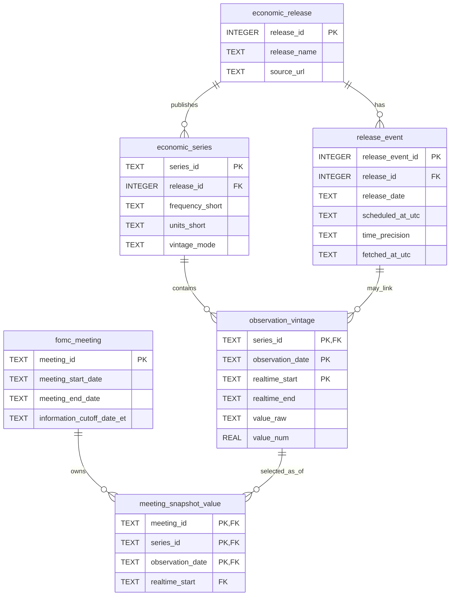

# FOMC 嚴格時點經濟資料庫：結構與使用手冊

本文件說明 `fred_fomc_real.sqlite` 的資料結構、嚴格時點規則、查詢方式、模型取數流程、更新方法與已知限制。除非特別註明，範例都以正式資料庫為準。

## 1. 資料庫用途

這份 SQLite 資料庫用來重建每一場 FOMC 會議開始前，決策者理論上能取得的經濟資訊集合。核心目標不是只保存今天看到的最新值，而是同時保存：

1. FRED／ALFRED 經濟指數及其歷史版本。
2. 官方 FOMC 會議日期與資訊截止日。
3. 每場會議依截止日選出的嚴格時點快照。
4. 可供 SQL、Python、模型或代理系統直接使用的整合檢視。

正式資料庫檔案：`fred_fomc_real.sqlite`

更新前備份：`fred_fomc_real.before_1996_backfill.sqlite`

## 2. 目前資料範圍

以下筆數是 2026-08-21 的資料庫快照；日後更新後會增加。

| 項目 | 目前內容 |
|---|---:|
| 經濟指數 | 19 個 |
| 歷史觀測版本 | 551,310 筆 |
| FOMC 會議 | 166 場 |
| 會議時點快照 | 1,108,721 筆 |
| 經濟數據公布來源 | 11 個 |
| 公布事件 | 11,744 筆 |
| 觀測資料範圍 | 1996-01-01 至 2026-08-20 |
| FOMC 會議範圍 | 2006-01-31 至 2026-07-28 |

### 2.1 指數配置

| 頻率 | 數量 | 每場上限 | Series ID |
|---|---:|---:|---|
| 日資料 D | 5 | 每個 1,008 筆 | `BAA10Y`, `DGS2`, `DGS10`, `T10YIE`, `T5YIFR` |
| 週資料 W | 2 | 每個 208 筆 | `ICSA`, `NFCI` |
| 月資料 M | 11 | 每個 120 筆 | `UNRATE`, `PAYEMS`, `PCEPILFE`, `CPIAUCSL`, `CPILFESL`, `PCEPI`, `CES0500000003`, `INDPRO`, `RSAFS`, `HOUST`, `PERMIT` |
| 季資料 Q | 1 | 40 筆 | `GDPC1` |

若所有系列在會議截止日前都有足夠歷史，一場會議最多有：

```text
5 × 1,008 + 2 × 208 + 11 × 120 + 1 × 40 = 6,816 筆
```

早期會議可能少於 6,816 筆，原因通常是系列尚未開始、ALFRED 當時沒有可用 vintage，或資料在截止日前尚未公布。嚴格模式會保留缺失，不會用後來的資料補洞。

## 3. 嚴格時點規則

資料庫 metadata 的關鍵設定如下：

| 設定 | 值 | 意義 |
|---|---|---|
| `dataset_status` | `REAL_FRED_ALFRED` | 正式資料，不是 DEMO |
| `point_in_time_mode` | `STRICT_AS_OF` | 僅使用截止日前可見版本 |
| `cutoff_policy` | `previous_calendar_day` | 資訊截止日為會議開始前一個曆日 |
| `missing_vintage_policy` | `PRESERVE_MISSING` | 上游沒有歷史版本時保持缺失 |
| `snapshot_window_policy` | `latest_visible_window_D1008_W208_M120_Q40` | 各頻率的快照窗口 |
| `fred_only_policy` | `OBSERVATION_DATE_PROXY_WITH_EXPLICIT_SERIES_MARKER` | FRED-only 系列使用觀測日代理可見日，並明確標記 |

對一場會議與一個系列，快照建立規則是：

1. 取得該會議的 `information_cutoff_date_et`。
2. 只考慮 `observation_date <= cutoff` 的觀測期。
3. 只考慮 `realtime_start <= cutoff` 的版本。
4. 每個觀測期選擇截止日前最大的 `realtime_start`，即當時最新可見版本。
5. 排除 `value_num IS NULL` 的缺值。
6. 依頻率只保留最近 D1008、W208、M120 或 Q40 個觀測期。

因此，模型若要模擬某場會議，應從 `meeting_snapshot_value` 或 `v_meeting_information_set` 取數，不應直接從 `observation_vintage` 選今天的最新版本。

## 4. 實體關係圖



`database_metadata` 是獨立的設定表；`v_meeting_information_set` 是整合會議、系列、快照與歷史版本的 SQL view。

## 5. 完整資料表說明

### 5.1 `database_metadata`

保存資料庫狀態、來源、同步時間與時點政策。

| 欄位 | 型別 | 約束 | 說明 |
|---|---|---|---|
| `key` | TEXT | PK | metadata 名稱 |
| `value` | TEXT | NOT NULL | metadata 值 |

### 5.2 `economic_release`

保存 FRED 的經濟數據公布來源。

| 欄位 | 型別 | 約束 | 說明 |
|---|---|---|---|
| `release_id` | INTEGER | PK | FRED release ID |
| `release_name` | TEXT | NOT NULL | 公布來源名稱 |
| `source_url` | TEXT | 允許 NULL | 官方來源網址 |

### 5.3 `release_event`

保存各公布來源的公布日期。目前大多只有日期精度，不代表精確到分鐘。

| 欄位 | 型別 | 約束 | 說明 |
|---|---|---|---|
| `release_event_id` | INTEGER | PK, AUTOINCREMENT | 內部公布事件鍵 |
| `release_id` | INTEGER | NOT NULL, FK | 對應 `economic_release.release_id` |
| `release_date` | TEXT | NOT NULL | ISO 日期 `YYYY-MM-DD` |
| `scheduled_at_utc` | TEXT | 允許 NULL | 若來源提供，保存預定 UTC 時間 |
| `time_precision` | TEXT | NOT NULL, CHECK | `date` 或 `minute` |
| `fetched_at_utc` | TEXT | NOT NULL | 此事件抓取時間 |

唯一鍵：`(release_id, release_date)`。

### 5.4 `economic_series`

保存每個 FRED series 的定義、頻率、單位、資料範圍及 vintage 能力。

| 欄位 | 型別 | 約束 | 說明 |
|---|---|---|---|
| `series_id` | TEXT | PK | FRED series ID |
| `title` | TEXT | NOT NULL | 指數名稱 |
| `release_id` | INTEGER | FK，允許 NULL | 對應公布來源 |
| `frequency` | TEXT | NOT NULL | 完整頻率名稱 |
| `frequency_short` | TEXT | 允許 NULL | `D`, `W`, `M`, `Q` |
| `units` | TEXT | NOT NULL | 完整單位名稱 |
| `units_short` | TEXT | 允許 NULL | 短單位 |
| `seasonal_adjustment` | TEXT | 允許 NULL | 季節調整方式 |
| `seasonal_adjustment_short` | TEXT | 允許 NULL | 短季調標記 |
| `observation_start` | TEXT | 允許 NULL | FRED metadata 的全系列起始日，不等於本庫一定從該日收錄 |
| `observation_end` | TEXT | 允許 NULL | FRED metadata 的目前結束日 |
| `upstream_last_updated` | TEXT | 允許 NULL | 上游最後更新時間 |
| `notes` | TEXT | 允許 NULL | FRED 系列說明 |
| `vintage_mode` | TEXT | NOT NULL, CHECK | `ALFRED` 或 `FRED_ONLY_OBSERVATION_DATE` |

### 5.5 `observation_vintage`

這是原始時點資料的核心表。同一個 `series_id + observation_date` 可以因修正而有多個 `realtime_start`。

| 欄位 | 型別 | 約束 | 說明 |
|---|---|---|---|
| `series_id` | TEXT | PK, FK | 指數 ID |
| `observation_date` | TEXT | PK | 數值所描述的經濟觀測期 |
| `realtime_start` | TEXT | PK | 此版本開始可見的日期 |
| `realtime_end` | TEXT | NOT NULL | 此版本有效期結束日；開放版本通常為 `9999-12-31` |
| `value_raw` | TEXT | NOT NULL | FRED 原始字串；缺值可能是 `.` |
| `value_num` | REAL | 允許 NULL | 方便運算的數值；缺值為 NULL |
| `is_initial_release` | INTEGER | NOT NULL, CHECK | 該觀測期最早收錄版本為 1，其他為 0 |
| `release_event_id` | INTEGER | FK，允許 NULL | 若可對應，連至公布事件 |
| `fetched_at_utc` | TEXT | NOT NULL | 抓取時間 |
| `source_hash` | TEXT | NOT NULL | 來源欄位的 SHA-256 完整性指紋 |

主鍵：`(series_id, observation_date, realtime_start)`。

注意：FRED-only 系列沒有 ALFRED 修訂鏈，會以 `observation_date` 代理 `realtime_start`。此時 `is_initial_release = 1` 只表示最早收錄的代理版本，不代表已驗證真實初次公布日。

### 5.6 `fomc_meeting`

保存正式 FOMC 會議與模型可使用資訊的截止日。

| 欄位 | 型別 | 約束 | 說明 |
|---|---|---|---|
| `meeting_id` | TEXT | PK | 例如 `FOMC-2006-01-31` |
| `meeting_start_date` | TEXT | NOT NULL | 會議開始日 |
| `meeting_end_date` | TEXT | NOT NULL | 會議結束日 |
| `information_cutoff_date_et` | TEXT | NOT NULL | 會議模擬的資訊截止日 |
| `cutoff_policy` | TEXT | NOT NULL | 目前為 `previous_calendar_day` |
| `calendar_source_url` | TEXT | NOT NULL | 聯準會官方行事曆來源 |

### 5.7 `meeting_snapshot_value`

將一場會議連到當時可見的特定 observation vintage。模型通常應透過此表或整合 view 取數。

| 欄位 | 型別 | 約束 | 說明 |
|---|---|---|---|
| `meeting_id` | TEXT | PK, FK | FOMC 會議 |
| `series_id` | TEXT | PK, FK | 指數 ID |
| `observation_date` | TEXT | PK, FK | 被選入的觀測期 |
| `realtime_start` | TEXT | FK | 被選入的可見版本日期 |
| `selection_policy` | TEXT | NOT NULL | 快照選擇政策 |
| `created_at_utc` | TEXT | NOT NULL | 快照建立時間 |

主鍵：`(meeting_id, series_id, observation_date)`。

複合外鍵 `(series_id, observation_date, realtime_start)` 指向 `observation_vintage`，可防止快照引用不存在的版本。

### 5.8 `v_meeting_information_set`

這是最適合一般分析與模型使用的整合 view，已經連好會議、系列名稱、單位、當時數值與可見版本。

| 欄位 | 來源／意義 |
|---|---|
| `meeting_id` | 會議 ID |
| `meeting_start_date` | 會議開始日 |
| `information_cutoff_date_et` | 資訊截止日 |
| `series_id` | FRED series ID |
| `title` | 指數名稱 |
| `frequency` | 指數頻率 |
| `units` | 指數單位 |
| `observation_date` | 經濟觀測期 |
| `value_num` | 當時可見的數值 |
| `value_raw` | 官方原始字串 |
| `visible_version_date` | 被選版本的 `realtime_start` |
| `version_realtime_end` | 該版本有效期結束日 |
| `is_initial_release` | 是否為最早收錄版本 |
| `selection_policy` | 快照政策 |

## 6. 索引與查詢效能

| 索引 | 欄位 | 主要用途 |
|---|---|---|
| `ix_vintage_asof` | `series_id, observation_date, realtime_start` | 截止日版本選擇 |
| `ix_release_event_date` | `release_date` | 依公布日找事件 |
| `ix_snapshot_meeting_series` | `meeting_id, series_id, observation_date` | 取得單場會議或單一系列快照 |

SQLite 也會為主鍵與 UNIQUE 約束建立內部 autoindex。

## 7. 快速開始

### 7.1 Python 以唯讀模式連線

Python 標準函式庫已包含 `sqlite3`，不必安裝資料庫套件。

```python
import sqlite3

connection = sqlite3.connect(
    "file:fred_fomc_real.sqlite?mode=ro",
    uri=True,
)
connection.row_factory = sqlite3.Row

status = connection.execute(
    "SELECT value FROM database_metadata WHERE key = 'dataset_status'"
).fetchone()[0]
print(status)  # REAL_FRED_ALFRED

connection.close()
```

建議分析與模型程式預設使用 `mode=ro`，避免誤寫正式資料庫。

### 7.2 若電腦有 SQLite CLI

```powershell
sqlite3 -readonly .\fred_fomc_real.sqlite
```

進入後可執行：

```sql
.headers on
.mode column
SELECT key, value FROM database_metadata ORDER BY key;
```

## 8. 常用 SQL 教學

### 8.1 查看所有指數

```sql
SELECT
    series_id,
    title,
    frequency_short,
    units_short,
    vintage_mode
FROM economic_series
ORDER BY frequency_short, series_id;
```

### 8.2 查看所有會議

```sql
SELECT
    meeting_id,
    meeting_start_date,
    meeting_end_date,
    information_cutoff_date_et
FROM fomc_meeting
ORDER BY meeting_start_date;
```

### 8.3 取得一場會議的完整資訊集合

```sql
SELECT
    series_id,
    title,
    units,
    observation_date,
    value_num,
    visible_version_date,
    is_initial_release
FROM v_meeting_information_set
WHERE meeting_id = 'FOMC-2006-01-31'
ORDER BY series_id, observation_date;
```

這是進行 FOMC 歷史模擬時最推薦的基礎查詢。

### 8.4 取得每個指數在會議前的最新一筆

```sql
WITH ranked AS (
    SELECT
        series_id,
        title,
        units,
        observation_date,
        value_num,
        visible_version_date,
        ROW_NUMBER() OVER (
            PARTITION BY series_id
            ORDER BY observation_date DESC
        ) AS row_number
    FROM v_meeting_information_set
    WHERE meeting_id = 'FOMC-2006-01-31'
)
SELECT
    series_id,
    title,
    units,
    observation_date,
    value_num,
    visible_version_date
FROM ranked
WHERE row_number = 1
ORDER BY series_id;
```

### 8.5 取得單一指數在某場會議的完整路徑

```sql
SELECT
    observation_date,
    value_num,
    visible_version_date
FROM v_meeting_information_set
WHERE meeting_id = 'FOMC-2006-01-31'
  AND series_id = 'UNRATE'
ORDER BY observation_date;
```

### 8.6 查看同一觀測期的初值與後續修正

```sql
SELECT
    series_id,
    observation_date,
    realtime_start,
    realtime_end,
    value_raw,
    value_num,
    is_initial_release
FROM observation_vintage
WHERE series_id = 'GDPC1'
  AND observation_date = '2023-10-01'
ORDER BY realtime_start;
```

這個查詢應用於 ALFRED 系列。若 `vintage_mode = 'FRED_ONLY_OBSERVATION_DATE'`，資料庫不具備完整官方修訂鏈。

### 8.7 查看一場會議各系列的實際筆數

```sql
WITH targets(frequency_short, target_rows) AS (
    VALUES ('D', 1008), ('W', 208), ('M', 120), ('Q', 40)
)
SELECT
    series.series_id,
    series.frequency_short,
    targets.target_rows,
    COUNT(snapshot.observation_date) AS actual_rows
FROM economic_series AS series
JOIN targets
  ON targets.frequency_short = series.frequency_short
LEFT JOIN meeting_snapshot_value AS snapshot
  ON snapshot.series_id = series.series_id
 AND snapshot.meeting_id = 'FOMC-2006-01-31'
GROUP BY
    series.series_id,
    series.frequency_short,
    targets.target_rows
ORDER BY series.frequency_short, series.series_id;
```

`actual_rows < target_rows` 不一定是錯誤。必須先確認該系列或 ALFRED vintage 在當時是否已存在。

### 8.8 找出某場會議完全沒有資料的系列

```sql
SELECT
    series.series_id,
    series.title,
    series.vintage_mode
FROM economic_series AS series
LEFT JOIN meeting_snapshot_value AS snapshot
  ON snapshot.series_id = series.series_id
 AND snapshot.meeting_id = 'FOMC-2006-01-31'
GROUP BY series.series_id, series.title, series.vintage_mode
HAVING COUNT(snapshot.observation_date) = 0
ORDER BY series.series_id;
```

### 8.9 查看某個日期後才變得可見的版本

```sql
SELECT
    series_id,
    observation_date,
    realtime_start,
    value_num
FROM observation_vintage
WHERE series_id = 'GDPC1'
  AND realtime_start > '2006-01-30'
ORDER BY realtime_start, observation_date
LIMIT 50;
```

這類資料不能放入截止日為 2006-01-30 的會議模擬。

## 9. Python 與 pandas 使用方式

### 9.1 讀取一場會議

```python
import sqlite3
import pandas as pd

meeting_id = "FOMC-2006-01-31"
connection = sqlite3.connect(
    "file:fred_fomc_real.sqlite?mode=ro",
    uri=True,
)

frame = pd.read_sql_query(
    """
    SELECT
        meeting_id,
        information_cutoff_date_et,
        series_id,
        title,
        units,
        observation_date,
        value_num,
        visible_version_date
    FROM v_meeting_information_set
    WHERE meeting_id = ?
    ORDER BY series_id, observation_date
    """,
    connection,
    params=(meeting_id,),
    parse_dates=[
        "information_cutoff_date_et",
        "observation_date",
        "visible_version_date",
    ],
)

connection.close()
print(frame.head())
```

### 9.2 轉成寬表

```python
wide = frame.pivot(
    index="observation_date",
    columns="series_id",
    values="value_num",
)
```

不同頻率共用日期索引時自然會出現空值。不要用會取得未來資料的 backfill；若模型需要補值，必須在單場會議快照內、按時間向前填補，並明確記錄方法。

### 9.3 建立每場會議的一列特徵

最簡單的方法是每個系列取會議前最新值：

```python
latest = (
    frame.sort_values("observation_date")
    .groupby("series_id", as_index=False)
    .tail(1)
)

features = latest.pivot_table(
    index="meeting_id",
    columns="series_id",
    values="value_num",
    aggfunc="last",
)
```

正式模型通常還應加入只使用快照內資料計算的變化率、趨勢、波動與 surprise 特徵。

## 10. FOMC 決策模擬建議流程

1. 選定 `meeting_id`。
2. 讀取 `fomc_meeting.information_cutoff_date_et`。
3. 僅從 `v_meeting_information_set` 取得該場資料。
4. 在該快照內計算同比、環比、移動平均或殖利率曲線等特徵。
5. 若加入會議文件、新聞或市場文字，所有文件也必須有相同截止日規則。
6. 保存模型輸入使用的 `meeting_id`、series、observation date 與 visible version date，確保可重現。
7. 將模型決策與該場實際決策比較，但不要把實際決策或會後資料放回模型輸入。

### 10.1 防止 look-ahead bias

禁止以下做法：

- 直接用今天 FRED 顯示的最新修正值模擬早期會議。
- 對早期缺少的 series 使用後來才發布的資料補齊。
- 以會議結束後或聲明公布後的市場價格作為會議前特徵。
- 跨越 `information_cutoff_date_et` 計算 rolling window。
- 因為早期會議少於 6,816 筆就自動以今日資料補洞。

## 11. 資料品質與限制

### 11.1 已驗證項目

- SQLite `integrity_check = ok`。
- foreign key violations = 0。
- 19 個指定 series 的官方目前日期與數值已完成對帳。
- 166 場會議與聯準會官方行事曆一致。
- 會議快照不存在截止日後資料或錯誤版本選擇。
- BAA10Y、DGS10、DGS2 的 1996–1999 缺口已補齊。

### 11.2 必須保留的限制

1. `FRED_ONLY_OBSERVATION_DATE` 系列沒有完整 ALFRED revision history。
2. `release_event_id` 允許 NULL，公布事件血緣不是 100%。
3. `scheduled_at_utc` 多數為 NULL，目前需求只保留日期精度。
4. 早期會議可能因上游系列或 vintage 尚不存在而缺少資料。
5. `economic_series.observation_start` 是 FRED 全系列 metadata；本資料庫的實際收錄下限由 `database_metadata.observation_start` 與各系列可取得範圍共同決定。
6. `value_raw = '.'` 代表上游缺值，此時 `value_num` 為 NULL，且不會進入會議快照。

## 12. 更新與維護

### 12.1 FRED API key

正式抓取只使用 Windows User 層級的 `FRED_API_KEY`。檢查是否存在時不要印出原值：

```powershell
$fredUserKey = [Environment]::GetEnvironmentVariable('FRED_API_KEY', 'User')
if ($fredUserKey) { 'FRED_API_KEY(User): set' } else { 'FRED_API_KEY(User): missing' }
```

### 12.2 更新前備份

先確認沒有其他程式正在寫入資料庫，再建立可回復副本：

```powershell
Copy-Item -LiteralPath .\fred_fomc_real.sqlite -Destination .\fred_fomc_real.before_update.sqlite
```

### 12.3 嚴格更新全部 19 個系列

將日期換成實際希望納入的官方會議截止日：

```powershell
python .\build_real_fred_db.py --output .\fred_fomc_real.sqlite --observation-start 1996-01-01 --update-existing --strict-point-in-time --calendar-through-date 2026-08-21
```

省略 `--series` 時使用程式內定義的 19 個預設 series。嚴格更新會重新建立所有 meeting snapshots，且在單一資料庫交易內完成；失敗時應回滾。

### 12.4 只同步 FOMC 會議

```powershell
python .\sync_fomc_meetings.py --database .\fred_fomc_real.sqlite --start-year 2006 --through-date 2026-08-21
```

此指令會從聯準會官方行事曆更新會議，並重新建立所有 meeting snapshots。

### 12.5 執行測試

```powershell
python -m unittest discover -s tests -v
```

### 12.6 唯讀完整性檢查

```python
import sqlite3

connection = sqlite3.connect(
    "file:fred_fomc_real.sqlite?mode=ro",
    uri=True,
)

print(connection.execute("PRAGMA integrity_check").fetchone()[0])
print(connection.execute("PRAGMA foreign_key_check").fetchall())

connection.close()
```

預期結果：

```text
ok
[]
```

## 13. 完整 DDL

以下為目前正式資料庫的標準化結構。SQLite 因 migration 建立的實際 SQL 排版可能不同，但欄位與約束相同。

```sql
PRAGMA foreign_keys = ON;

CREATE TABLE database_metadata (
    key   TEXT PRIMARY KEY,
    value TEXT NOT NULL
);

CREATE TABLE economic_release (
    release_id   INTEGER PRIMARY KEY,
    release_name TEXT NOT NULL,
    source_url   TEXT
);

CREATE TABLE release_event (
    release_event_id INTEGER PRIMARY KEY AUTOINCREMENT,
    release_id       INTEGER NOT NULL,
    release_date     TEXT NOT NULL,
    scheduled_at_utc TEXT,
    time_precision   TEXT NOT NULL
        CHECK (time_precision IN ('date', 'minute')),
    fetched_at_utc   TEXT NOT NULL,
    FOREIGN KEY (release_id) REFERENCES economic_release(release_id),
    UNIQUE (release_id, release_date)
);

CREATE TABLE economic_series (
    series_id                   TEXT PRIMARY KEY,
    title                       TEXT NOT NULL,
    release_id                  INTEGER,
    frequency                   TEXT NOT NULL,
    frequency_short             TEXT,
    units                       TEXT NOT NULL,
    units_short                 TEXT,
    seasonal_adjustment         TEXT,
    seasonal_adjustment_short   TEXT,
    observation_start           TEXT,
    observation_end             TEXT,
    upstream_last_updated       TEXT,
    notes                       TEXT,
    vintage_mode                TEXT NOT NULL DEFAULT 'ALFRED'
        CHECK (vintage_mode IN ('ALFRED', 'FRED_ONLY_OBSERVATION_DATE')),
    FOREIGN KEY (release_id) REFERENCES economic_release(release_id)
);

CREATE TABLE observation_vintage (
    series_id          TEXT NOT NULL,
    observation_date   TEXT NOT NULL,
    realtime_start     TEXT NOT NULL,
    realtime_end       TEXT NOT NULL,
    value_raw          TEXT NOT NULL,
    value_num          REAL,
    is_initial_release INTEGER NOT NULL
        CHECK (is_initial_release IN (0, 1)),
    release_event_id   INTEGER,
    fetched_at_utc     TEXT NOT NULL,
    source_hash        TEXT NOT NULL,
    PRIMARY KEY (series_id, observation_date, realtime_start),
    FOREIGN KEY (series_id) REFERENCES economic_series(series_id),
    FOREIGN KEY (release_event_id) REFERENCES release_event(release_event_id),
    CHECK (realtime_end >= realtime_start)
);

CREATE TABLE fomc_meeting (
    meeting_id                 TEXT PRIMARY KEY,
    meeting_start_date         TEXT NOT NULL,
    meeting_end_date           TEXT NOT NULL,
    information_cutoff_date_et TEXT NOT NULL,
    cutoff_policy              TEXT NOT NULL,
    calendar_source_url        TEXT NOT NULL
);

CREATE TABLE meeting_snapshot_value (
    meeting_id        TEXT NOT NULL,
    series_id         TEXT NOT NULL,
    observation_date TEXT NOT NULL,
    realtime_start   TEXT NOT NULL,
    selection_policy TEXT NOT NULL,
    created_at_utc   TEXT NOT NULL,
    PRIMARY KEY (meeting_id, series_id, observation_date),
    FOREIGN KEY (meeting_id) REFERENCES fomc_meeting(meeting_id),
    FOREIGN KEY (series_id, observation_date, realtime_start)
        REFERENCES observation_vintage(series_id, observation_date, realtime_start)
);

CREATE INDEX ix_vintage_asof
    ON observation_vintage(series_id, observation_date, realtime_start);

CREATE INDEX ix_release_event_date
    ON release_event(release_date);

CREATE INDEX ix_snapshot_meeting_series
    ON meeting_snapshot_value(meeting_id, series_id, observation_date);

CREATE VIEW v_meeting_information_set AS
SELECT
    meeting.meeting_id,
    meeting.meeting_start_date,
    meeting.information_cutoff_date_et,
    series.series_id,
    series.title,
    series.frequency,
    series.units,
    snapshot.observation_date,
    observation.value_num,
    observation.value_raw,
    observation.realtime_start AS visible_version_date,
    observation.realtime_end AS version_realtime_end,
    observation.is_initial_release,
    snapshot.selection_policy
FROM meeting_snapshot_value AS snapshot
JOIN fomc_meeting AS meeting
  ON meeting.meeting_id = snapshot.meeting_id
JOIN observation_vintage AS observation
  ON observation.series_id = snapshot.series_id
 AND observation.observation_date = snapshot.observation_date
 AND observation.realtime_start = snapshot.realtime_start
JOIN economic_series AS series
  ON series.series_id = snapshot.series_id;
```

## 14. 使用原則摘要

- 模擬 FOMC：從 `v_meeting_information_set` 依 `meeting_id` 取數。
- 研究修訂歷史：從 `observation_vintage` 依 `series_id + observation_date` 取數。
- 查公布事件：使用 `economic_release` 與 `release_event`，但保留血緣與時間精度限制。
- 讀正式資料庫：優先使用唯讀連線。
- 早期缺失：保留 NULL 或缺少列，不使用未來資料補齊。
- 每次更新：先備份、更新、跑測試、執行 integrity／foreign-key 檢查，再做官方來源對帳。
