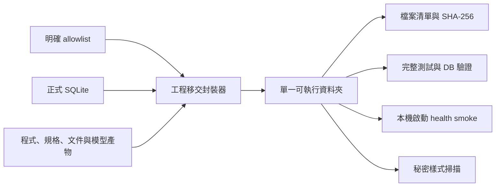

# FOMC R5 工程移交封裝計畫

## 目標

從目前已驗證的工作區建立一個可由團隊工程師直接接手的單一資料夾；資料夾必須包含可啟動的離線技術 MVP、兩個正式 SQLite、必要來源文件、規格、測試、模型產物與明確的未完成事項，同時排除備份、快取、暫存與敏感設定。

## 已驗證假設

- 專案根目錄是 `D:\AI\代碼儲存\fred`。
- 專案不是 Git repository，因此不能建立或宣稱 annotated-tag release；本次交付是有 SHA-256 的 working-tree engineering snapshot。
- 應用程式以專案根目錄的 `fred_fomc_real.sqlite` 與 `fomc_simulation.sqlite` 運作。
- 兩個 SQLite 是本次離線研究 MVP 的正式凍結資料，不代表線上 production datastore。
- 競賽最終 gate 仍有真人抽查、Edge 最終演練、v14 manifest 與 submission sign-off 四個 blocker。

## 依賴圖

## 里程碑

1. 範圍凍結
   - 只納入目前 R5 工程接手所需的明確檔案與目錄。
   - 明確排除 `*.pre_*.sqlite`、`*.before_*.sqlite`、暫存、快取、Word lock、舊版規劃與任何秘密檔案。
2. 封裝器
   - 以原子方式建立全新輸出目錄。
   - 寫出 `ENGINEERING_HANDOFF_zh-TW.md`、`HANDOFF_MANIFEST.json`、`SOURCE_FILES.txt` 與 `SHA256SUMS.txt`。
   - 針對檔名與文字內容執行高信心秘密樣式掃描。
3. 可重現驗證
   - 驗證資料夾內檔案與 `SOURCE_FILES.txt` 完全一致。
   - 重新計算全部 SHA-256。
   - 從封裝根目錄執行測試、SQLite integrity/FK 與 Streamlit health smoke。
4. 移交說明
   - 說明系統現況、啟動方式、正式資料庫邊界、四個未完成 gate、回復方式與工程師第一週建議順序。

## 風險

- 工作區沒有 Git history/tag；接手者只能用 package manifest 與 SHA-256 驗證這個快照，無法從 commit 重建。
- `artifacts/codex_subscription` 與官方文件使資料夾較大，但它們是離線證據與可重現性的一部分。
- SQLite 內含公開 FOMC/FRED 研究資料；不是客戶資料，但接手團隊仍應依內部儲存政策管理。
- 最終 Edge 與真人 gate 尚未完成；移交包不可改稱 Hackathon final READY 或 production release。

## 不在範圍

- 不完成真人審查或冒充真人簽核。
- 不建立 Git repository、commit、tag、remote 或推送。
- 不部署、不上傳雲端、不連接 production datastore。
- 不刪除目前工作區的任何備份或暫存檔。

## 回復方式

封裝只會新增一個全新的 `engineering_handoff` 子資料夾與封裝器／測試／本計畫；不改寫兩個正式資料庫。若不採用，只需保留原工作區並忽略新增的封裝資料夾即可。
