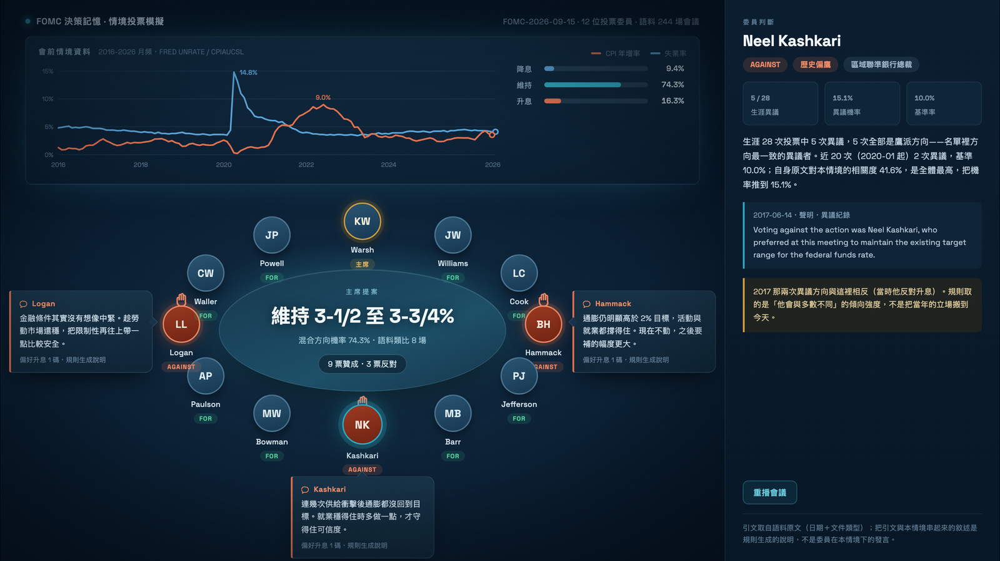

# FOMC 決策記憶 Lab · FOMC Decision Memory Lab

**組織忘記的不是資料，是「當初為什麼這樣決定」。**
這套系統把每一次重大決策存成可追溯的 **DecisionTrace**——當時看見哪些數字、
桌上有哪些選項、誰支持誰反對、哪些假設撐著這個決定——並在第一個反證出現時
把討論重新叫起來。

我們用 **FOMC（聯準會公開市場委員會）** 當 benchmark：它是全世界少數把
「會前資料、會中爭論、逐人投票、事後紀要」全部公開的決策機構，因此每一個
宣稱都可以拿真實紀錄回測，而不是靠 demo 講故事。

<p align="center">
  
</p>

---

## 這個專案在解什麼問題

市場每次都在猜同一件事：「這次會不會降息？」但決定利率的不是「市場」，
是桌邊那十幾個人——他們各自投票，而且**會有人投反對**。

沒有人在做的是：說出**哪一位**會反對，以及**為什麼**。

放大來看，這正是所有組織的通病。真正的問題有兩層，而且兩層都是**時間**問題：

| | 定義 | 誰該負責縮短 |
| --- | --- | --- |
| **Recognition lag（認知落後）** | 第一個反證出現後，官方措辭花多久才承認狀態改變 | **這是我們要幫組織縮短的。** |
| **Action lag（行動落後）** | 承認之後，政策花多久才真正改變 | 可能是刻意的執行節奏，不該混稱為組織失憶 |

把兩者混為一談，就會把「刻意等待」誤判成「集體失憶」。本系統把它們分開量測。

**目標使用者**

- 需要追蹤重大決策依據的企業主管與策略團隊
- 必須定期更新投資／經濟觀點的研究與風險團隊
- 想回顧群體決策品質、分歧與反應速度的治理單位

---

## 兩個入口

| | 內容 | 需要什麼 |
| --- | --- | --- |
| **`dist/FOMC_RAG_Vote_Simulator.html`** | **主要展示**：輸入會前的總體與市場情境，BM25 從 244 場會議的 3,553 段原文檢索條件最接近的會議，推論政策方向、**逐一委員的投票**與每個判斷的原文出處 | 只要瀏覽器 |
| `src/scene/fomc-meeting-scene.html` | 同一組結果換成會議室的樣子：12 個席次、舉手的是投反對票的人，點任一位展開他為什麼這樣投 | 只要瀏覽器 |
| `src/app/` | R5 Streamlit 應用程式：Decision Replay、Assumption Monitor、Simulation & Evidence | Python 3.11 ＋ 4 個外部資料庫 |

離線頁面的索引已內嵌在 HTML 裡，第一次按「執行 RAG 情境預測」約 1 秒建索引，之後即時。
**整個模擬過程不呼叫任何 LLM**，全部是瀏覽器內的確定性算術——所以離線也跑得動，
而且同樣的輸入永遠得到同樣的輸出。

Streamlit 應用程式的安裝與啟動步驟，見 **[`docs/SETUP_zh-TW.md`](docs/SETUP_zh-TW.md)**。

---

## 這套系統是怎麼運作的

```
data/communications.csv     479 份 FOMC 文件（243 會議紀要 + 225 聲明 + 11 已排定）
        │                   雙重 UTF-8 編碼修復 → 解析
        ▼
src/retrieval/build_rag_index.py
        │                   切段、標條件標籤、抽異議句、判鷹鴿方向
        ▼
fomc_rag_index.json         244 場會議 · 3,553 段可檢索原文 · 68 位具名委員 · 88 筆異議
        │
        ▼
build_app.py  ──►  dist/FOMC_RAG_Vote_Simulator.html  （索引內嵌，離線可跑）
                          │
                          ├─ BM25 取回 K=400 段 → 去重成會議
                          ├─ 依條件標籤重排（矛盾標籤 δ=1.5 扣分）→ 取前 M=8 場
                          ├─ 類比會議的實際決策加權投票  ──┐
                          ├─ pooled ordered logit（R5 封存係數，唯讀）─┤→ 混合方向
                          └─ 逐人票 = 歷史異議基準率 × 方向張力 × 自身原文相關度
```

從語料萃取出來的東西：

| 項目 | 數量 |
| --- | --- |
| 會議 | **244 場**（2000-02-02 – 2026-07-29） |
| 可檢索段落 | **3,553 段**（單段上限 1,400 字元） |
| 具名投票委員 | **68 位** |
| 異議紀錄 | **88 筆**，含鷹／鴿方向判定 |
| 政策行動標記 | 221 場有明確利率決策（升息 40、維持 147、降息 34） |

**行動標記的驗證**：與 R5 封存的 `pooled_ordered_logit_v1.json` 的 121 場訓練標籤
比對，**120 場一致**。唯一差異是 2020-03 的臨時降息——R5 標為「維持」，本工具依
聲明原文標為「降息」。

**方向與逐人票分開顯示，因為它們會吵架。** 計量模型與資料檢索各給一組機率，畫面
兩排並列；不一致時直接跳出警示，而不是給一個假裝有共識的數字。回測數字、全部參數
與其代價寫在 [`docs/MODEL_zh-TW.md`](docs/MODEL_zh-TW.md)，包含我們**刻意不修**的
那一項，以及為什麼修了會更糟。

---

## 專案結構

```
FOMC-Decision-Memory/
├── README.md                       ← 你在這裡
│
├── dist/
│   └── FOMC_RAG_Vote_Simulator.html  ★ 主要離線展示（開瀏覽器即可）
│
├── src/
│   ├── app/                        Streamlit 應用程式（1,005 檔，雜湊列管）
│   ├── retrieval/                  RAG 索引建置與回測評估腳本
│   └── scene/                      會議現場動畫
│
├── data/
│   └── communications.csv          479 份 FOMC 原始文件語料
│
├── release/                        釋出 manifest、SHA-256、IT 部署文件
│
└── docs/
    ├── SETUP_zh-TW.md              安裝、啟動、常見問題
    ├── MODEL_zh-TW.md              模型權重、全部參數與方法邊界
    ├── ENGINEERING_LOG_zh-TW.md    問題與解法摘要（開發過程）
    └── screenshots/
```

`dist/FOMC_RAG_Vote_Simulator.html` 是 `src/retrieval/build_app.py` 把
`fomc_rag_index.json` 與 R5 封存係數注進 `app_template.html` 產生的；改了索引或
參數就重跑 `cd src/retrieval && python3 build_app.py`。

### 文件

| | |
| --- | --- |
| [`docs/SETUP_zh-TW.md`](docs/SETUP_zh-TW.md) | Streamlit App 的安裝、啟動與常見問題 |
| [`docs/MODEL_zh-TW.md`](docs/MODEL_zh-TW.md) | RAG 模擬的完整模型權重、全部參數、回測結果與方法邊界 |
| [`docs/ENGINEERING_LOG_zh-TW.md`](docs/ENGINEERING_LOG_zh-TW.md) | 開發過程真正踩到的坑與修法，每項附可重跑的驗證 |

### 可重跑的驗證

這個 repo 的每個結構性宣稱都有對應指令，不必相信文件：

```sh
# 成品可從原始碼重建，且逐位元組相同
cd src/retrieval && python3 build_app.py

# payload 檔案清單與 manifest 完全一致（1,005 筆）
cd src/app && find . -type f -not -name '.DS_Store' -not -path '*/__pycache__/*' \
  | sed 's|^\./||' | LC_ALL=C sort \
  | diff - ../../release/01_Manifests-and-Integrity/SOURCE_FILES.txt

# 釋出檔案未被竄改
cd release && shasum -a 256 -c 01_Manifests-and-Integrity/SHA256SUMS.txt

# 離線建置雜湊清單與封存 manifest 相符（需先建好 .venv，見 SETUP）
cd src/app && ../../.venv/bin/python -m decision_memory.submission_gate
```

### 資料在哪裡

4 個執行期 `.sqlite` 資料庫與 `official_documents/` **刻意不在版本庫裡**，以
external frozen inputs 另外遞交。這不是檔案損壞：`RELEASE_MANIFEST.json` 的
`excluded` 明列 `"runtime databases"`，`SOURCE_FILES.txt` 也沒有任何 `.sqlite` 條目。
8 項檔案的 SHA-256 清單在
[`src/app/IT_DATA_INPUTS_zh-TW.md`](src/app/IT_DATA_INPUTS_zh-TW.md)。

同樣地，`artifacts/codex_subscription/` 與 `artifacts/llm_preflight/`（385 個封存的
模型 run，共 360 MB）由 payload 自己的 `.gitignore` 排除，改由 artifact manifest
治理。**上面兩個離線頁面不需要其中任何一項。**

---

## 團隊

| GitHub | 角色 |
| --- | --- |
| [@Ooolaa](https://github.com/Ooolaa) | 專案維護 |
| [@b91303046](https://github.com/b91303046) | 共同開發 |
| [@Tempest-s](https://github.com/Tempest-s) | 共同開發 |
| [@phidelia-tsao](https://github.com/phidelia-tsao) | 共同開發 |

詳見 [`CONTRIBUTORS.md`](CONTRIBUTORS.md)。

---

## 資料來源

- **FOMC 會後聲明、會議紀要、逐字稿**：Board of Governors of the Federal Reserve System（公開資料）
- **總體經濟序列**：FRED / ALFRED（嚴格 point-in-time，模型只看得到會議當時已公布的 vintage）

本專案與美國聯準會無任何關聯，所有模擬輸出皆為研究用途，不構成投資建議。
