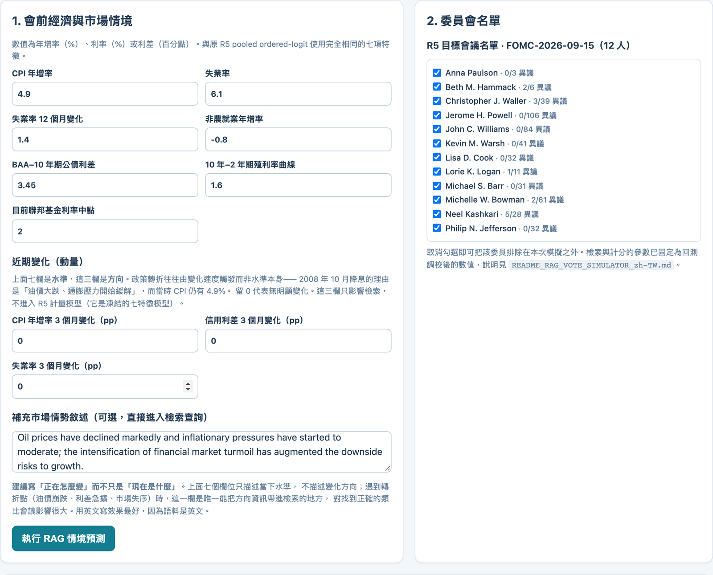
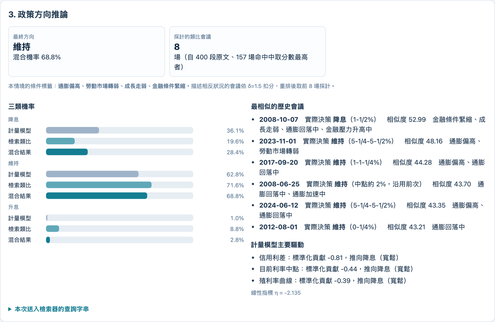
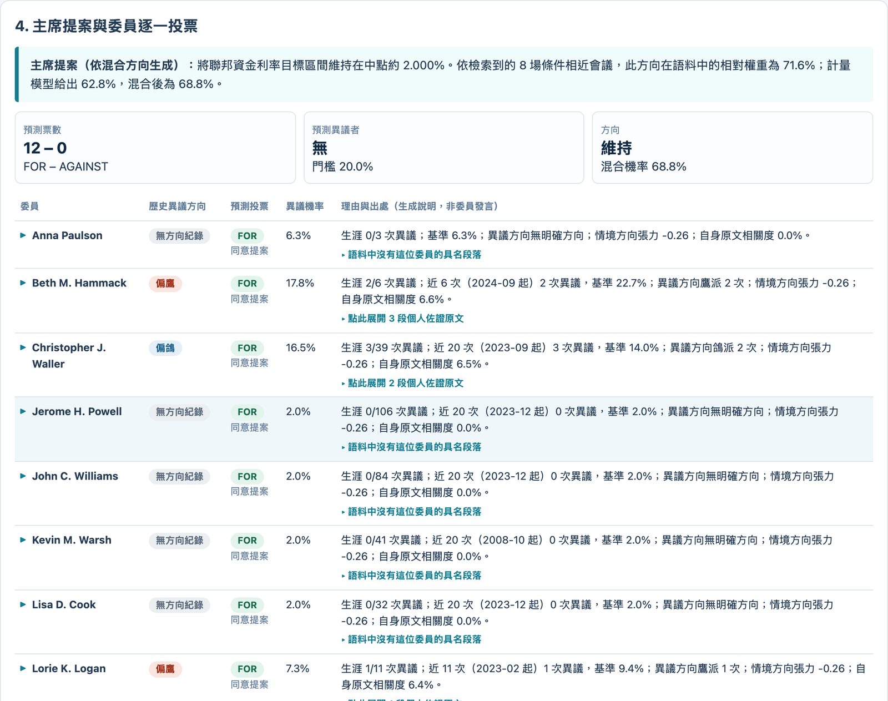
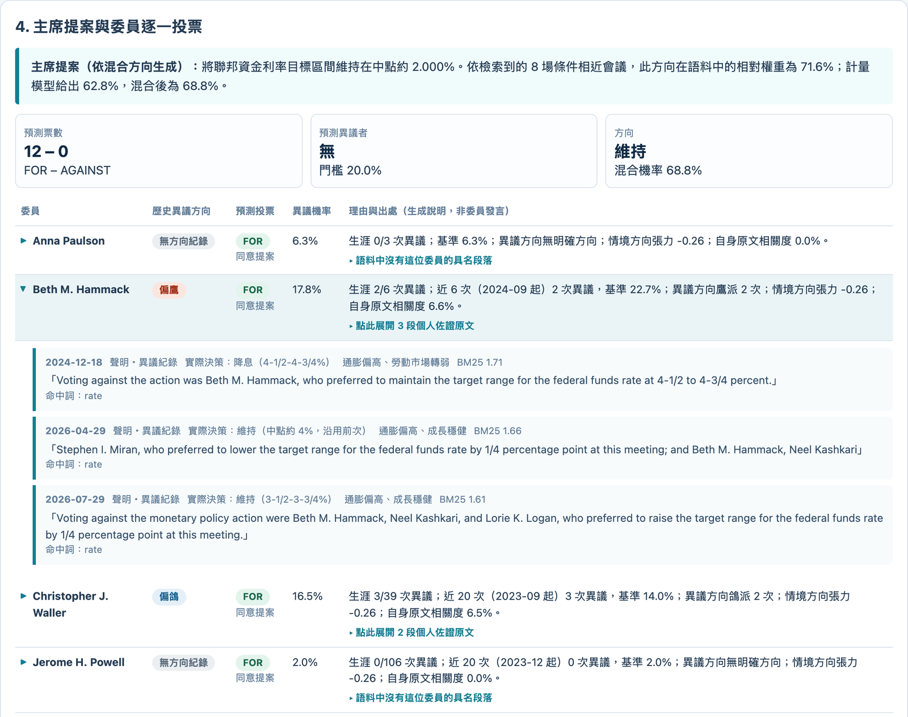
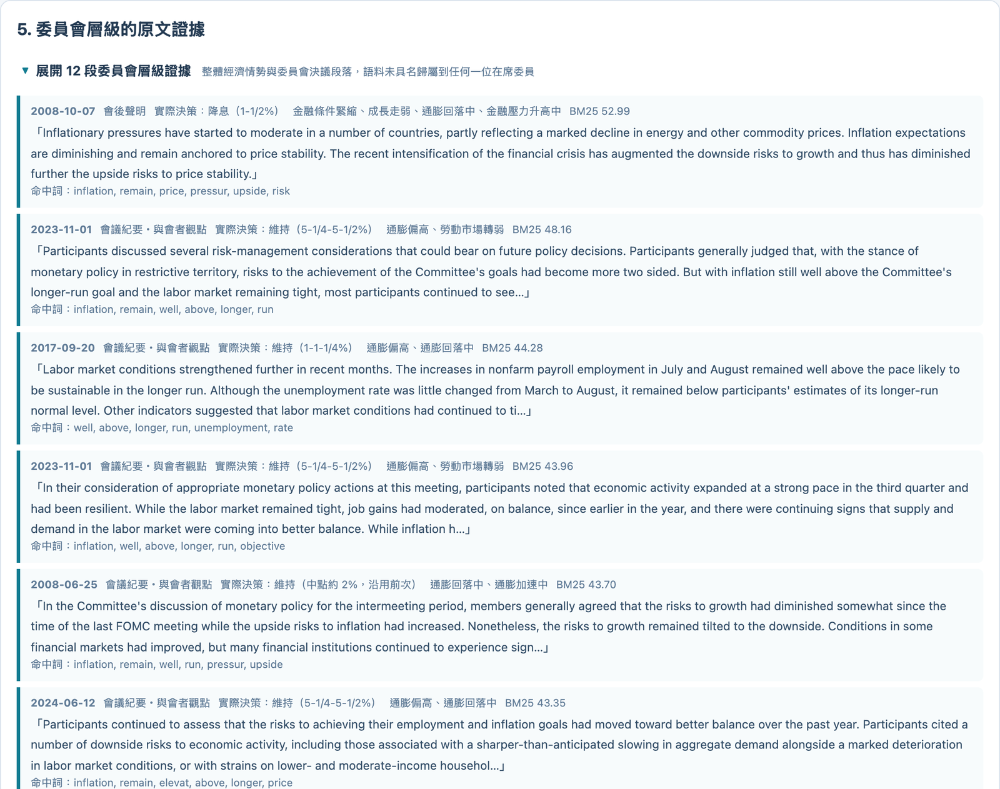
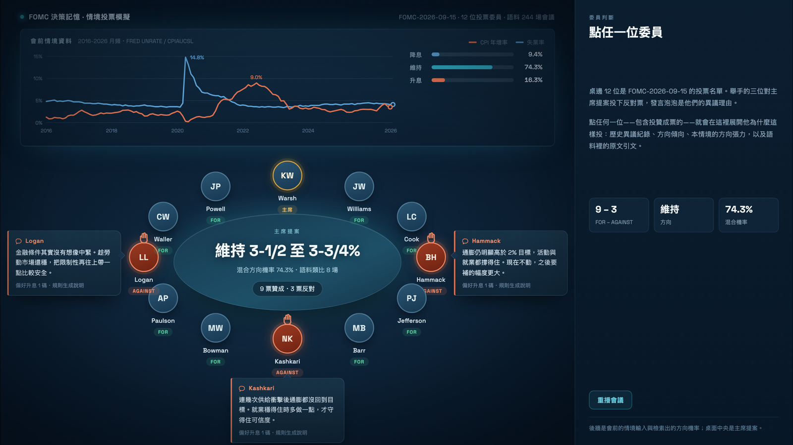
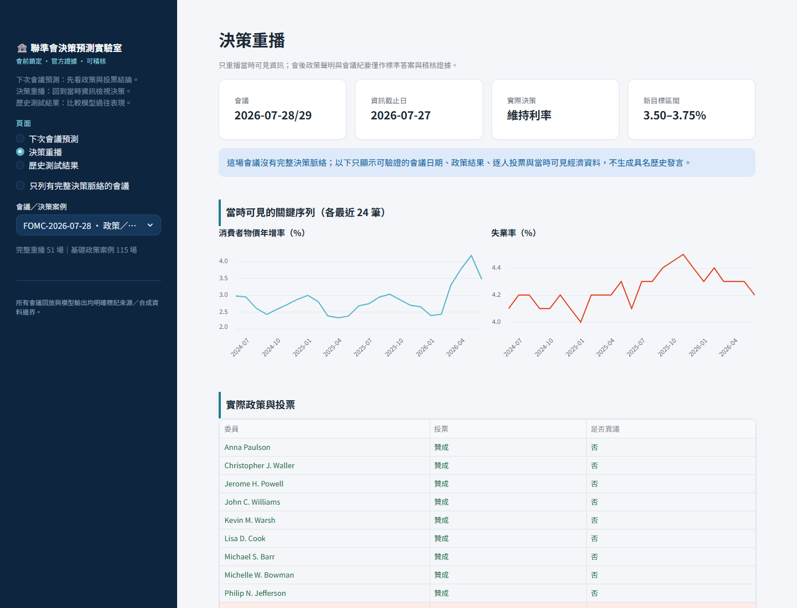
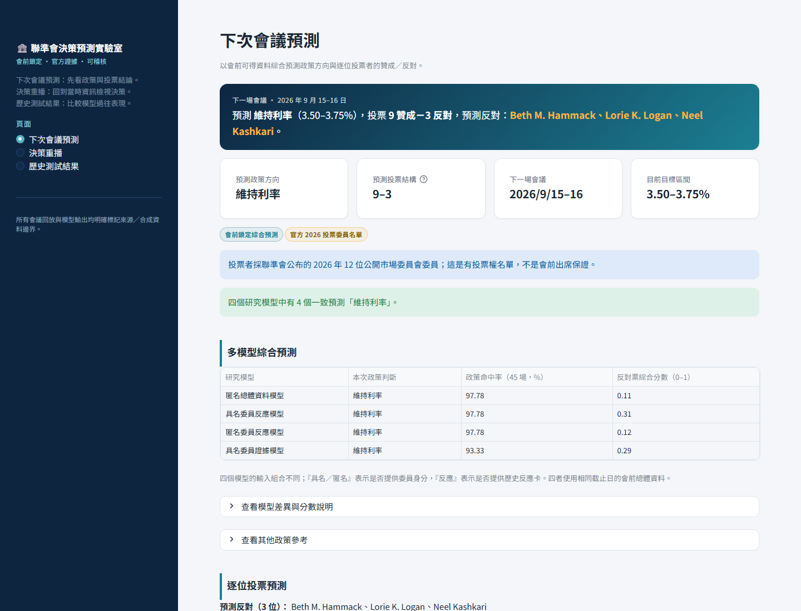

# FOMC 決策記憶 Lab · FOMC Decision Memory Lab

**組織忘記的不是資料，是「當初為什麼這樣決定」。**
這套系統把每一次重大決策存成可追溯的 **DecisionTrace**——當時看見哪些數字、
桌上有哪些選項、誰支持誰反對、哪些假設撐著這個決定——並在第一個反證出現時
把討論重新叫起來。

我們用 **FOMC（聯準會公開市場委員會）** 當 benchmark：它是全世界少數把
「會前資料、會中爭論、逐人投票、事後紀要」全部公開的決策機構，因此每一個
宣稱都可以拿真實紀錄回測，而不是靠 demo 講故事。

<p align="center">
  
</p>

<p align="center">
  <a href="#60-秒上手">60 秒上手</a> ·
  <a href="#展示一次完整的推論">功能展示</a> ·
  <a href="#方法與回測誠實揭露">回測數字</a> ·
  <a href="#邊界與揭露">邊界</a> ·
  <a href="#團隊">團隊</a>
</p>

---

## 這個專案在解什麼問題

市場每次都在猜同一件事：「這次會不會降息？」但決定利率的不是「市場」，
是桌邊那十幾個人——他們各自投票，而且**會有人投反對**。

沒有人在做的是：說出**哪一位**會反對，以及**為什麼**。

放大來看，這正是所有組織的通病。真正的問題有兩層，而且兩層都是**時間**問題：

| | 定義 | 誰該負責縮短 |
| --- | --- | --- |
| **Recognition lag（認知落後）** | 第一個反證出現後，官方措辭花多久才承認狀態改變 | **這是我們要幫組織縮短的。** |
| **Action lag（行動落後）** | 承認之後，政策花多久才真正改變 | 可能是刻意的執行節奏，不該混稱為組織失憶 |

把兩者混為一談，就會把「刻意等待」誤判成「集體失憶」。本系統把它們分開量測。

**目標使用者**

- 需要追蹤重大決策依據的企業主管與策略團隊
- 必須定期更新投資／經濟觀點的研究與風險團隊
- 想回顧群體決策品質、分歧與反應速度的治理單位

---

## 60 秒上手

### 最快的路：兩個離線網頁，零安裝

不需要 Python、資料庫、網路或 API 金鑰——`git clone` 後用瀏覽器直接開：

```sh
git clone https://github.com/Ooolaa/FOMC-Decision-Memory.git
cd FOMC-Decision-Memory
open FOMC_RAG_Vote_Simulator.html          # macOS
# Windows: start FOMC_RAG_Vote_Simulator.html
# Linux:   xdg-open FOMC_RAG_Vote_Simulator.html
```

| 檔案 | 內容 | 需要什麼 |
| --- | --- | --- |
| **`FOMC_RAG_Vote_Simulator.html`** | **主要展示**：BM25 檢索 244 場會議的 3,553 段原文，推論政策方向、逐一委員投票與出處 | 只要瀏覽器 |
| `05_Design_Canvas/fomc-meeting-scene.html` | 會議現場動畫：12 個席次、舉手反對、點任一位展開理由 | 只要瀏覽器 |
| `FOMC_Vote_Scenario_Lab.html` | 純計量模型的情境投票（無檢索），作為對照組 | 只要瀏覽器 |

> 頁面內含完整倒排索引，第一次按「執行 RAG 情境預測」約 1 秒建索引，之後即時。
> **整個模擬過程不呼叫任何 LLM**，全部是瀏覽器內的確定性算術——所以離線也跑得動，
> 而且同樣的輸入永遠得到同樣的輸出。

### 完整的路：R5 Streamlit 應用程式

三個離線頁面（Decision Replay、Assumption Monitor、Simulation & Evidence）在
`02_Application/`。**它需要 4 個 `.sqlite` 執行期資料庫，那些檔案刻意不放進版本庫**
（見〈[資料在哪裡](#資料在哪裡)〉）。安裝與啟動步驟完整寫在
**[`README_zh-TW.md`](README_zh-TW.md)**。

```sh
# 需 Python 3.11（不是 3.12，原因見 README_zh-TW.md）
python3.11 -m venv 03_Environment/.venv
03_Environment/.venv/bin/python -m pip install -r 02_Application/requirements.txt

cd 02_Application
export PYTHONUTF8=1
export FOMC_APP_DB="$PWD/fomc_simulation.decision_trace_50_display.sqlite"
../03_Environment/.venv/bin/python -m streamlit run app.py \
  --server.headless true --server.address 127.0.0.1 --server.port 8503
```

---

## Demo 影片

**[`06_Video_Assets/FOMC_Demo_zh-TW.mp4`](06_Video_Assets/FOMC_Demo_zh-TW.mp4)** ——
1920×1080、2 分 45 秒、中文字幕已燒進畫面。

影片是**操作真實系統錄下來的**，不是簡報動畫：Playwright 逐格驅動上面那兩個網頁、
旁白用 macOS `say` 合成、AVFoundation 合軌。時間軸只有一個來源——旁白逐句實測長度後
寫進 `narration.json`，畫面用同一組數字決定停留秒數，所以改腳本重跑一定同步。
整條管線與重建步驟在 [`06_Video_Assets/README.md`](06_Video_Assets/README.md)。

---

## 展示：一次完整的推論

下面每一張都是跑真實系統截下來的，用**同一個情境**：2008 年 10 月的總體數據——
帳面通膨還很高（CPI 4.9%），但失業率一年內跳了 1.4 個百分點、非農就業轉負、
BAA–10 年期信用利差爆到 3.45 個百分點。這正是**帳面數字和前瞻證據吵架**的時刻。

> 想自己重跑這些截圖：`node 06_Video_Assets/capture_screenshots.mjs`（需先起
> `python3 -m http.server 8810`）。

### ① 輸入會前情境

七個總體特徵（與原 R5 pooled ordered-logit 完全相同的七項）、三個動量欄，
外加一段自由文字的市場敘述。右欄是這場會議的投票名單。



### ② 方向從哪裡來——而且刻意分成兩排

上排是**計量模型**（ordered logit），下排是**資料檢索**（條件最像的 8 場會議實際
怎麼決定）。**分開顯示，因為它們會吵架。**

這一次檢索排第一的，就是 **2008-10-07 那場真實會議**（相似度 52.99，實際決策是
**降息**到 1-1/2%）——系統確實從 244 場會議裡把正確的歷史類比撈了出來。但另外
7 場類比多數是「維持」，計量模型也給維持 62.8%，所以混合後的結論是 **維持 68.8%、
降息 28.4%**。

**我們寧可讓你看見這個分歧，也不要給一個假裝有共識的數字。** 畫面同時列出計量
模型的主要驅動（信用利差 −0.81、利率中點 −0.44、殖利率曲線 −0.39，三個都推向降息），
你能一眼看出模型內部哪裡在拉扯。



### ③ 逐一委員的票，不是只有方向

主席提案由混合方向生成，然後**每一位在席委員各自有一張票、一個異議機率、一段理由**。



### ④ 每一票都點得開，而且追得回原文

點任一位委員，展開的是**這位委員自己在語料裡的紀錄**——投反對票的原句、日期、
文件類型、BM25 分數。下圖是 Beth M. Hammack：生涯 2/6 次異議、近 6 次有 2 次，
底下三段是 2024-12-18、2026-04-29、2026-07-29 的原始異議句。

**理由欄明確標成「生成說明，非委員發言」**——敘述是規則生成的，引文才是原文。



### ⑤ 委員會層級的原文證據

最後列出支撐這次判斷的 12 段委員會層級原文，每段都帶日期、文件類型、該場**實際
決策**、條件標籤、BM25 分數與命中詞。第一段就是 2008-10-07 的會後聲明原文：

> *"Inflationary pressures have started to moderate… The recent intensification of
> the financial crisis has augmented the downside risks to growth."*



### ⑥ 會議現場

同一組結果換成會議室的樣子：12 個席次、舉手的三位是投下反對票的人、發言泡泡是
他們的異議理由。點任何一位——包含投贊成票的——右欄就展開他為什麼這樣投。



### 其他情境

`docs/screenshots/scenarios/` 另有四組完整長截圖：Lehman 2008、COVID 2020-02 與
2020-03、以及動量特徵開啟前後的對照。

### R5 Streamlit 應用程式

| Decision Replay | Next-Meeting Forecast |
| --- | --- |
|  |  |

**Decision Replay 只重播當時可見的資訊**：資訊截止日、當時可見的關鍵序列、實際
政策與逐人投票。會後的政策聲明與會議紀要只當作標準答案與稽核證據，不餵回模型。

---

## 這套系統是怎麼運作的

```
communications.csv          479 份 FOMC 文件（243 會議紀要 + 225 聲明 + 11 已排定）
        │                   雙重 UTF-8 編碼修復 → 解析
        ▼
04_RAG_Vote_Simulator/build_rag_index.py
        │                   切段、標條件標籤、抽異議句、判鷹鴿方向
        ▼
fomc_rag_index.json         244 場會議 · 3,553 段可檢索原文 · 68 位具名委員 · 88 筆異議
        │
        ▼
build_app.py  ──►  FOMC_RAG_Vote_Simulator.html   （索引內嵌，離線可跑）
                          │
                          ├─ BM25 取回 K=400 段 → 去重成會議
                          ├─ 依條件標籤重排（矛盾標籤 δ=1.5 扣分）→ 取前 M=8 場
                          ├─ 類比會議的實際決策加權投票  ──┐
                          ├─ pooled ordered logit（R5 封存係數，唯讀）─┤→ 混合方向
                          └─ 逐人票 = 歷史異議基準率 × 方向張力 × 自身原文相關度
```

從語料萃取出來的東西：

| 項目 | 數量 |
| --- | --- |
| 會議 | **244 場**（2000-02-02 – 2026-07-29） |
| 可檢索段落 | **3,553 段**（單段上限 1,400 字元） |
| 具名投票委員 | **68 位** |
| 異議紀錄 | **88 筆**，含鷹／鴿方向判定 |
| 政策行動標記 | 221 場有明確利率決策（升息 40、維持 147、降息 34） |

**行動標記的驗證**：與 R5 封存的 `pooled_ordered_logit_v1.json` 的 121 場訓練標籤
比對，**120 場一致**。唯一差異是 2020-03 的臨時降息——R5 標為「維持」，本工具依
聲明原文標為「降息」。

---

## 方法與回測（誠實揭露）

以每場會議聲明中的**經濟情勢敘述**當查詢（已剔除所有含利率決策、投票與實施註記的
句子），檢索時排除該場及**前後各 2 場**會議，再以檢索到的類比會議實際決策加權投票。
重跑：`python3 04_RAG_Vote_Simulator/eval_tags.py`。

| 設定 | 準確率 | 平衡準確率 | 降息／維持／升息召回率 |
| --- | --- | --- | --- |
| **預設**（K=400, M=8, β=0, γ=0, δ=1.5） | **74.2%** | **61.4%** | 35% / 86% / 62% |
| 加上相同標籤加分（γ=0.6, M=6） | 72.4% | 62.0% | 41% / 82% / 62% |
| 不限制 M，全部命中加總 | 66.5% | 45.3% | 9% / 87% / 40% |
| 多數類基準（全猜「維持」） | 66.5% | 33.3% | 0% / 100% / 0% |

**這個數字仍可能偏樂觀，而且對互動使用高估得更多。** 兩個原因：

1. 排除前後各 2 場之外，同一政策循環內的會議語言仍高度自相關。
2. 回測的查詢是**該場會議自己的聲明原文**，用字自然跟同年代文件一致；互動介面的
   查詢卻是用現代 Fed 語彙合成的敘述，會系統性偏向詞彙相近的近期會議。用 2008 年
   9 月的總體數據測試時，前幾名類比一度全是 2023 年的「維持」會議——**回測完全看
   不到這個誤差來源。**

### 我們修掉的與刻意不修的

| | 狀況 | 處置 |
| --- | --- | --- |
| ✅ 已修 | **語料涵蓋率的年代偏差**（真正的 bug）：原切段規則依賴 2009 年後才固定的體例，導致 2000–2009 每場只有 1.6–5.9 段、2012–2026 每場 17–19 段，整個危機年代在檢索池裡幾乎不存在 | 不足 10 段的會議改用政策詞密度最高的段落補足，各年代平均變成 11 對 17 |
| ✅ 已修 | **重排候選池太小**：原本只取前 40 段，去重後約 25 場、全是近期會議 | K 放大到 400，2008 年的會議才有機會進入排序 |
| ❌ 刻意不修 | **γ（相同標籤加分）**：能讓 2008 情境的降息機率從 17.5% 拉到 43.8%，但同一機制會讓 2020-03 情境被「勞動市場緊俏＋成長穩健」兩個常見標籤蓋過「金融條件緊縮」，結論翻成**升息**——比修正前更糟 | **停用**（`PARAMS.gamma = 0`），程式碼保留路徑並註明原因 |

所有權重、參數與其代價完整寫在
**[`README_RAG_VOTE_SIMULATOR_zh-TW.md`](README_RAG_VOTE_SIMULATOR_zh-TW.md)**；
回測腳本在 [`04_RAG_Vote_Simulator/`](04_RAG_Vote_Simulator/)。

---

## 專案結構

```
FOMC-Decision-Memory/
├── README.md                          ← 你在這裡
├── README_zh-TW.md                    R5 交付說明：安裝、啟動、常見問題
├── README_RAG_VOTE_SIMULATOR_zh-TW.md RAG 模擬的完整模型權重、參數與邊界
├── AGENTS.md                          給 AI coding agent 的工作守則（重要，見下）
├── VIDEO_SCRIPT_zh-TW.md              影片腳本與章節時間碼
│
├── FOMC_RAG_Vote_Simulator.html       ★ 主要離線展示（開瀏覽器即可）
├── FOMC_Vote_Scenario_Lab.html        純計量模型對照組
├── communications.csv                 479 份 FOMC 原始文件語料
│
├── 01_Release-Handoff/                釋出 manifest、SHA-256、IT 部署文件
├── 02_Application/                    R5 應用程式本體（1,102 檔，逐位元組凍結）
├── 03_Environment/                    Python 3.11 環境紀錄
├── 04_RAG_Vote_Simulator/             索引建置與回測評估腳本
├── 05_Design_Canvas/                  會議現場動畫
├── 06_Video_Assets/                   影片製作管線與成片
└── docs/screenshots/                  本 README 的截圖與重製腳本
```

> ### ⚠️ `02_Application/` 是雜湊列管的凍結 payload
> App 全部以相對路徑解析資料：光是 `artifacts/` 就被引用 41 次、`document_manifests/`
> 12 次；連根目錄的 `.md` 都被 `decision_memory/engineering_handoff.py` 列為必須位於
> 根層。**搬動任何一項都會讓 App 與測試失效。** 要用 AI agent 處理本專案，請先讓它讀
> [`AGENTS.md`](AGENTS.md)——照直覺「整理」會靜默破壞雜湊驗證。

### 資料在哪裡

4 個執行期 `.sqlite` 資料庫與 `official_documents/` **刻意不在版本庫裡**，以
external frozen inputs 另外遞交。這不是檔案損壞：`RELEASE_MANIFEST.json` 的
`excluded` 明列 `"runtime databases"`，`SOURCE_FILES.txt` 也沒有任何 `.sqlite` 條目。
8 項檔案的 SHA-256 清單在
[`02_Application/IT_DATA_INPUTS_zh-TW.md`](02_Application/IT_DATA_INPUTS_zh-TW.md)。

同樣地，`artifacts/codex_subscription/` 與 `artifacts/llm_preflight/`（385 個封存的
模型 run，共 360 MB）由 payload 自己的 `.gitignore` 排除，改由 artifact manifest
治理。**上面兩個離線網頁不需要其中任何一項。**

---

## 邊界與揭露

我們**不把另一個 LLM 當唯一裁判**。資料 cutoff、證據引用、speaker attribution、
政策結果、票數平衡與 lag，全部由可重跑的規則與 SQLite artifact 驗證；模型負責生成
與權衡，系統負責記憶、邊界與稽核。

- **FOMC 是 benchmark，不是最終產品邊界。** 企業案例是明確標示的 synthetic/composite，不是真實客戶案例。
- **所有生成發言都標示為 synthetic**，不冒充任何歷史原話。委員理由欄一律標註「生成說明，非委員發言」；只有引號內的原文引文取自語料。
- **Recognition lag 是可觀察的 statement 文字代理**，不是對內部認知的讀心。
- **RAG 投票模擬本身不呼叫任何 LLM**，是瀏覽器內的確定性算術。原 R5 才有用 LLM（`gpt-5.6-terra`，385 個封存 forecast run）。
- **Hackathon reaction model 用 BAA10Y 當窄義信用情勢 proxy**，它不是 NFCI，也不是完整金融情勢指標。
- **失敗會直接顯示。** Demo 案例的政策方向雖然正確，逐人投票只對 8/9，並漏掉實際異議者 James Bullard——這個結果直接呈現在畫面上，不以名冊 coverage 或整體政策準確率掩蓋。
- **未完成 repeats、信賴區間或 promotion gate 前，不宣稱模型已具統計顯著優勢。**

---

## 團隊

| GitHub | 角色 |
| --- | --- |
| [@Ooolaa](https://github.com/Ooolaa) | 專案維護 |
| [@b91303046](https://github.com/b91303046) | 共同開發 |
| [@Tempest-s](https://github.com/Tempest-s) | 共同開發 |
| [@phidelia-tsao](https://github.com/phidelia-tsao) | 共同開發 |

詳見 [`CONTRIBUTORS.md`](CONTRIBUTORS.md)。

---

## 資料來源

- **FOMC 會後聲明、會議紀要、逐字稿**：Board of Governors of the Federal Reserve System（公開資料）
- **總體經濟序列**：FRED / ALFRED（嚴格 point-in-time，模型只看得到會議當時已公布的 vintage）

本專案與美國聯準會無任何關聯，所有模擬輸出皆為研究用途，不構成投資建議。
